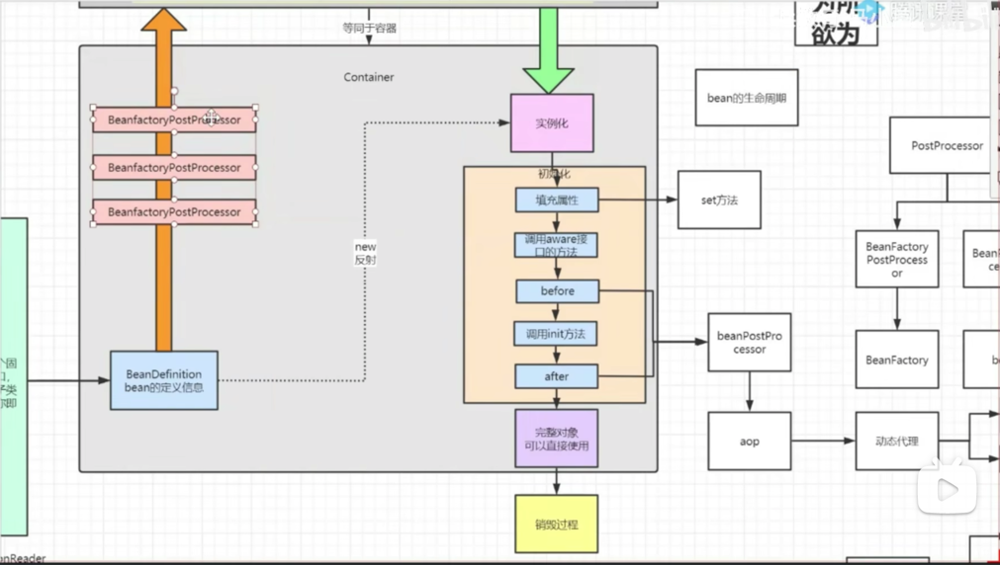

## Bean的生命周期
    populateBean 给Bean进行属性赋值
    initializeBean
    {
        applyBeanPostProcessorsBeforeInitialization
        invokeInitMethods
        applyBeanPostProcessorsAfterInitialization
    }
    1、Bean进行属性赋值
    2、后置before
    3、初始化方法
    4、后置after
    5、销毁方法

## @Qualifier()
    使用此注解需要装配组件的id,而不是使用属性名

## @Primary
    让Spring进行自动装配的时候，默认使用首选的Bean，优先级没有@Qualifier高

## @Resource ｜ @Autowired
    @Resource 默认按照组件名称进行装配的，不能支持@Primary 是Java的原生注解
    @Autowired 是spring的注解
    AutowireAnnotationBeanPostProcessor: 解析完成自动装配功能
    
## @Bean
    @Bean 标注的方法创建对象的时候，方法参数的值从容器中获取
    
    @Bean
    public Person person(Xl xl) {
    // 这里的xl就是从容器中获取的
    return new Person()
    }

### @ConditionalOnProperty(prefix = "spring.aop", name = "auto", havingValue = "true", matchIfMissing = true)
    解释： 在配置文件中获取前缀为spring.aop的属性，并在其之下找到auto这个属性，如果属性是true那么注入Bean到容器中
          matchIfMissing = true 如果前面的配置不存在，默认是true，就是要注入此Bean
          
### @AliasFor
    @Retention(RetentionPolicy.RUNTIME)
    @Target(ElementType.METHOD)
    @Documented
    public @interface AliasFor {
        // AliasFor别名
    	@AliasFor("attribute")
    	String value() default "";
    	
    	@AliasFor("value")
    	String attribute() default "";
    	
    	// 能为继承的对象起别名
    	Class<? extends Annotation> annotation() default Annotation.class;
    }
    
### spring类加载过程
    1、初始化 AnnotationConfigApplicationContext{AnnotatedBeanDefinitionReader[reader] + ClassPathBeanDefinitionScanner[scanner]}
    2、注册组件到 reader
        2.1 会调父类方法给属性赋值 AbstractBeanDefinition(beanClass)
        
## 组件
    1、ApplicationContextAware 实现拥有spring上下文
    当一个类实现了这个接口之后，这个类就可以方便的获得ApplicationContext对象（spring上下文），Spring发现某个Bean实现了ApplicationContextAware接口，Spring容器会在创建该Bean之后，自动调用该Bean的setApplicationContext（参数）方法，调用该方法时，会将容器本身ApplicationContext对象作为参数传递给该方法。
    
    2、FactoryBean 作用提供规范统一的实例创建过程
    
### 容器和对象的创建流程
    1、先创建容器
    2、加载配置文件文件，封装成BeanDefinition
    3、调用执行BeanFactoryPostProcessor
    准备工作
        准备beanPostProcessor
        准备监听器、事件、广播器
    4、实例化
    5、初始化
    6、获取到完整对象
    

    
### IOC 接口
    1、IOC思想基于IOC容器完成，IOC容器底层就是对象工厂
    2、Spring提供IOC容器实现两种方式：
        （1）BeanFactory：IOC容器基本实现，是Spring内部的使用接口，不提供开发人员进行使用
            加载配置文件时候不会创建对象，在获取对象才会去创建对象，懒汉
        （2）ApplicationContext: BeanFactory接口的子接口，提供更多更强大的功能，一半由开发人员进行使用
            加载配置文件时候就会把配置文件对象进行创建，饿汉
    
```java
public void refresh() throws BeansException, IllegalStateException {
        synchronized (this.startupShutdownMonitor) {
            //刷新前的预处理;
            prepareRefresh();

            //获取BeanFactory；默认实现是DefaultListableBeanFactory，在创建容器的时候创建的
            ConfigurableListableBeanFactory beanFactory = obtainFreshBeanFactory();

            //BeanFactory的预准备工作（BeanFactory进行一些设置，比如context的类加载器，BeanPostProcessor和XXXAware自动装配等）
            prepareBeanFactory(beanFactory);

            try {
                //BeanFactory准备工作完成后进行的后置处理工作
                postProcessBeanFactory(beanFactory);

                //执行BeanFactoryPostProcessor的方法；
                invokeBeanFactoryPostProcessors(beanFactory);

                //注册BeanPostProcessor（Bean的后置处理器），在创建bean的前后等执行
                registerBeanPostProcessors(beanFactory);

                //初始化MessageSource组件（做国际化功能；消息绑定，消息解析）；
                initMessageSource();

                //初始化事件派发器
                initApplicationEventMulticaster();

                //子类重写这个方法，在容器刷新的时候可以自定义逻辑；如创建Tomcat，Jetty等WEB服务器
                onRefresh();

                //注册应用的监听器。就是注册实现了ApplicationListener接口的监听器bean，这些监听器是注册到ApplicationEventMulticaster中的
                registerListeners();

                //初始化所有剩下的非懒加载的单例bean
                finishBeanFactoryInitialization(beanFactory);

                //完成context的刷新。主要是调用LifecycleProcessor的onRefresh()方法，并且发布事件（ContextRefreshedEvent）
                finishRefresh();
            }

            ......
    }

```

Spring容器的refresh()【创建刷新】;
1、prepareRefresh()刷新前的预处理;
	1）、initPropertySources()初始化一些属性设置;子类自定义个性化的属性设置方法；
	2）、getEnvironment().validateRequiredProperties();检验属性的合法等
	3）、earlyApplicationEvents= new LinkedHashSet<ApplicationEvent>();保存容器中的一些早期的事件；
2、obtainFreshBeanFactory();获取BeanFactory；
	1）、refreshBeanFactory();刷新【创建】BeanFactory；
			创建了一个this.beanFactory = new DefaultListableBeanFactory();
			设置id；
	2）、getBeanFactory();返回刚才GenericApplicationContext创建的BeanFactory对象；
	3）、将创建的BeanFactory【DefaultListableBeanFactory】返回；
3、prepareBeanFactory(beanFactory);BeanFactory的预准备工作（BeanFactory进行一些设置）；
	1）、设置BeanFactory的类加载器、支持表达式解析器...
	2）、添加部分BeanPostProcessor【ApplicationContextAwareProcessor】
	3）、设置忽略的自动装配的接口EnvironmentAware、EmbeddedValueResolverAware、xxx；
	4）、注册可以解析的自动装配；我们能直接在任何组件中自动注入：
			BeanFactory、ResourceLoader、ApplicationEventPublisher、ApplicationContext
	5）、添加BeanPostProcessor【ApplicationListenerDetector】
	6）、添加编译时的AspectJ；
	7）、给BeanFactory中注册一些能用的组件；
		environment【ConfigurableEnvironment】、
		systemProperties【Map<String, Object>】、
		systemEnvironment【Map<String, Object>】
4、postProcessBeanFactory(beanFactory);BeanFactory准备工作完成后进行的后置处理工作；
	1）、子类通过重写这个方法来在BeanFactory创建并预准备完成以后做进一步的设置
======================以上是BeanFactory的创建及预准备工作==================================
5、invokeBeanFactoryPostProcessors(beanFactory);执行BeanFactoryPostProcessor的方法；
	BeanFactoryPostProcessor：BeanFactory的后置处理器。在BeanFactory标准初始化之后执行的；
	两个接口：BeanFactoryPostProcessor、BeanDefinitionRegistryPostProcessor
	1）、执行BeanFactoryPostProcessor的方法；
		先执行BeanDefinitionRegistryPostProcessor
		1）、获取所有的BeanDefinitionRegistryPostProcessor；
		2）、看先执行实现了PriorityOrdered优先级接口的BeanDefinitionRegistryPostProcessor、
			postProcessor.postProcessBeanDefinitionRegistry(registry)
		3）、在执行实现了Ordered顺序接口的BeanDefinitionRegistryPostProcessor；
			postProcessor.postProcessBeanDefinitionRegistry(registry)
		4）、最后执行没有实现任何优先级或者是顺序接口的BeanDefinitionRegistryPostProcessors；
			postProcessor.postProcessBeanDefinitionRegistry(registry)
			
		
		再执行BeanFactoryPostProcessor的方法
		1）、获取所有的BeanFactoryPostProcessor
		2）、看先执行实现了PriorityOrdered优先级接口的BeanFactoryPostProcessor、
			postProcessor.postProcessBeanFactory()
		3）、在执行实现了Ordered顺序接口的BeanFactoryPostProcessor；
			postProcessor.postProcessBeanFactory()
		4）、最后执行没有实现任何优先级或者是顺序接口的BeanFactoryPostProcessor；
			postProcessor.postProcessBeanFactory()
6、registerBeanPostProcessors(beanFactory);注册BeanPostProcessor（Bean的后置处理器）【 intercept bean creation】
		不同接口类型的BeanPostProcessor；在Bean创建前后的执行时机是不一样的
		BeanPostProcessor、
		DestructionAwareBeanPostProcessor、
		InstantiationAwareBeanPostProcessor、
		SmartInstantiationAwareBeanPostProcessor、
		MergedBeanDefinitionPostProcessor【internalPostProcessors】、
		
		1）、获取所有的 BeanPostProcessor;后置处理器都默认可以通过PriorityOrdered、Ordered接口来执行优先级
		2）、先注册PriorityOrdered优先级接口的BeanPostProcessor；
			把每一个BeanPostProcessor；添加到BeanFactory中:	beanFactory.addBeanPostProcessor(postProcessor);
		3）、再注册Ordered接口的
		4）、最后注册没有实现任何优先级接口的
		5）、最终注册MergedBeanDefinitionPostProcessor；
		6）、注册一个ApplicationListenerDetector；来在Bean创建完成后检查是否是ApplicationListener，如果是
			applicationContext.addApplicationListener((ApplicationListener<?>) bean);
7、initMessageSource();初始化MessageSource组件（做国际化功能；消息绑定，消息解析）；
		1）、获取BeanFactory
		2）、看容器中是否有id为messageSource的，类型是MessageSource的组件
			如果有赋值给messageSource，如果没有自己创建一个DelegatingMessageSource；
				MessageSource：取出国际化配置文件中的某个key的值；能按照区域信息获取；
		3）、把创建好的MessageSource注册在容器中，以后获取国际化配置文件的值的时候，可以自动注入MessageSource；
			beanFactory.registerSingleton(MESSAGE_SOURCE_BEAN_NAME, this.messageSource);	
			MessageSource.getMessage(String code, Object[] args, String defaultMessage, Locale locale);
8、initApplicationEventMulticaster();初始化事件派发器；
		1）、获取BeanFactory
		2）、从BeanFactory中获取applicationEventMulticaster的ApplicationEventMulticaster；
		3）、如果上一步没有配置；创建一个SimpleApplicationEventMulticaster
		4）、将创建的ApplicationEventMulticaster添加到BeanFactory中，以后其他组件直接自动注入
9、onRefresh();留给子容器（子类）
		1、子类重写这个方法，在容器刷新的时候可以自定义逻辑；
10、registerListeners();给容器中将所有项目里面的ApplicationListener注册进来；
		1、从容器中拿到所有的ApplicationListener
		2、将每个监听器添加到事件派发器中；
			getApplicationEventMulticaster().addApplicationListenerBean(listenerBeanName);
		3、派发之前步骤产生的事件；
11、finishBeanFactoryInitialization(beanFactory);初始化所有剩下的单实例bean；
	1、beanFactory.preInstantiateSingletons();初始化后剩下的单实例bean
		1）、获取容器中的所有Bean，依次进行初始化和创建对象
		2）、获取Bean的定义信息；RootBeanDefinition
		3）、Bean不是抽象的，是单实例的，是懒加载；
			1）、判断是否是FactoryBean；是否是实现FactoryBean接口的Bean；
			2）、不是工厂Bean。利用getBean(beanName);创建对象
				0、getBean(beanName)； ioc.getBean();
				1、doGetBean(name, null, null, false);
				2、先获取缓存中保存的单实例Bean。如果能获取到说明这个Bean之前被创建过（所有创建过的单实例Bean都会被缓存起来）
					从private final Map<String, Object> singletonObjects = new ConcurrentHashMap<String, Object>(256);获取的
				3、缓存中获取不到，开始Bean的创建对象流程；
				4、标记当前bean已经被创建
				5、获取Bean的定义信息；
				6、【获取当前Bean依赖的其他Bean;如果有按照getBean()把依赖的Bean先创建出来；】
				7、启动单实例Bean的创建流程；
					1）、createBean(beanName, mbd, args);
					2）、Object bean = resolveBeforeInstantiation(beanName, mbdToUse);让BeanPostProcessor先拦截返回代理对象；
						【InstantiationAwareBeanPostProcessor】：提前执行；
						先触发：postProcessBeforeInstantiation()；
						如果有返回值：触发postProcessAfterInitialization()；
					3）、如果前面的InstantiationAwareBeanPostProcessor没有返回代理对象；调用4）
					4）、Object beanInstance = doCreateBean(beanName, mbdToUse, args);创建Bean
						 1）、【创建Bean实例】；createBeanInstance(beanName, mbd, args);
						 	利用工厂方法或者对象的构造器创建出Bean实例；
						 2）、applyMergedBeanDefinitionPostProcessors(mbd, beanType, beanName);
						 	调用MergedBeanDefinitionPostProcessor的postProcessMergedBeanDefinition(mbd, beanType, beanName);
						 3）、【Bean属性赋值】populateBean(beanName, mbd, instanceWrapper);
						 	赋值之前：
						 	1）、拿到InstantiationAwareBeanPostProcessor后置处理器；
						 		postProcessAfterInstantiation()；
						 	2）、拿到InstantiationAwareBeanPostProcessor后置处理器；
						 		postProcessPropertyValues()；
						 	=====赋值之前：===
						 	3）、应用Bean属性的值；为属性利用setter方法等进行赋值；
						 		applyPropertyValues(beanName, mbd, bw, pvs);
						 4）、【Bean初始化】initializeBean(beanName, exposedObject, mbd);
						 	1）、【执行Aware接口方法】invokeAwareMethods(beanName, bean);执行xxxAware接口的方法
						 		BeanNameAware\BeanClassLoaderAware\BeanFactoryAware
						 	2）、【执行后置处理器初始化之前】applyBeanPostProcessorsBeforeInitialization(wrappedBean, beanName);
						 		BeanPostProcessor.postProcessBeforeInitialization（）;
						 	3）、【执行初始化方法】invokeInitMethods(beanName, wrappedBean, mbd);
						 		1）、是否是InitializingBean接口的实现；执行接口规定的初始化；
						 		2）、是否自定义初始化方法；
						 	4）、【执行后置处理器初始化之后】applyBeanPostProcessorsAfterInitialization
						 		BeanPostProcessor.postProcessAfterInitialization()；
						 5）、注册Bean的销毁方法；
					5）、将创建的Bean添加到缓存中singletonObjects；
				ioc容器就是这些Map；很多的Map里面保存了单实例Bean，环境信息。。。。；
		所有Bean都利用getBean创建完成以后；
			检查所有的Bean是否是SmartInitializingSingleton接口的；如果是；就执行afterSingletonsInstantiated()；
12、finishRefresh();完成BeanFactory的初始化创建工作；IOC容器就创建完成；
		1）、initLifecycleProcessor();初始化和生命周期有关的后置处理器；LifecycleProcessor
			默认从容器中找是否有lifecycleProcessor的组件【LifecycleProcessor】；如果没有new DefaultLifecycleProcessor();
			加入到容器；
			
			写一个LifecycleProcessor的实现类，可以在BeanFactory
				void onRefresh();
				void onClose();	
		2）、	getLifecycleProcessor().onRefresh();
			拿到前面定义的生命周期处理器（BeanFactory）；回调onRefresh()；
		3）、publishEvent(new ContextRefreshedEvent(this));发布容器刷新完成事件；
		4）、liveBeansView.registerApplicationContext(this);
	
	======总结===========
	1）、Spring容器在启动的时候，先会保存所有注册进来的Bean的定义信息；
		1）、xml注册bean；<bean>
		2）、注解注册Bean；@Service、@Component、@Bean、xxx
	2）、Spring容器会合适的时机创建这些Bean
		1）、用到这个bean的时候；利用getBean创建bean；创建好以后保存在容器中；
		2）、统一创建剩下所有的bean的时候；finishBeanFactoryInitialization()；
	3）、后置处理器；BeanPostProcessor
		1）、每一个bean创建完成，都会使用各种后置处理器进行处理；来增强bean的功能；
			AutowiredAnnotationBeanPostProcessor:处理自动注入
			AnnotationAwareAspectJAutoProxyCreator:来做AOP功能；
			xxx....
			增强的功能注解：
			AsyncAnnotationBeanPostProcessor
			....
	4）、事件驱动模型；
		ApplicationListener；事件监听；
		ApplicationEventMulticaster；事件派发：
				
### 
    spring的核心大概几点，首先一个对象的生命周期，最简单就是创建，使用，销毁这三步，这三步能让一个简单的对象使用起来，但是不能用于所有情况，
    比如AB循环依赖，所以我们将对象的创建拆分为如下几个步骤
    1、首先收集类信息，用于构建Bean使用，无论是采用xml还是注解我们主要还是收集BeanDefinition的数据，这个操作完全依赖于
        Spring开放出来的扩展接口：BeanFactoryPostProcess 下面的 ConfigurationClassPostProcessor 子类去解析注解
        obtainFreshBeanFactory refrsh
        
注解创建对象源码：
    BeanFactoryPostProcessor 
-> ConfigurationClassPostProcessor 
   - postProcessBeanDefinitionRegistry(BeanDefinitionRegistry b) 
   - processConfigBeanDefinitions(registry)
   - parser.parse(candidates)
   - arse(((AbstractBeanDefinition) bd).getBeanClass(), holder.getBeanName())
   - processConfigurationClass(new ConfigurationClass(clazz, beanName))
   - doProcessConfigurationClass(configClass, sourceClass)
   - 解析@Compent @PropertySources @ComponentScan @ImportResource @Bean @Import    
    
    
    
     